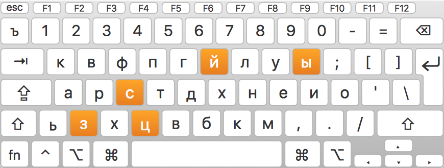

# Colemak-Translit

Russian transliteration based on colemak layout.
## Instalation
1. Download `Translit.keylayout`
2. Move file to `~/Library/Keyboard Layouts/` 
3. Restart
4. Select layout in keyboard preferences
